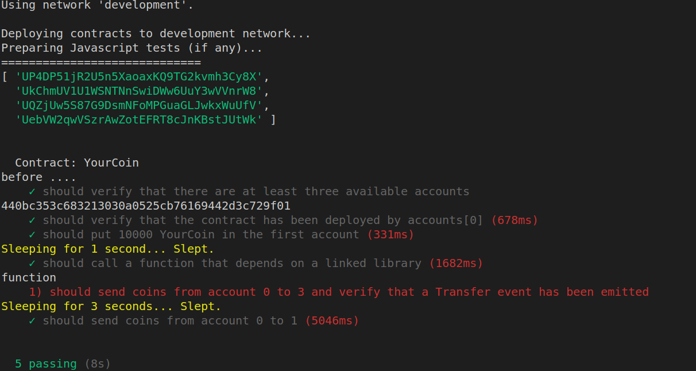

# UTool & Smart contract template 
Utool is a tool to work with smart contracts on UniChain platform. It's the same to use Truffle to work with Ethereum.
The example below show you how to use Utool to compile, deploy and call smart contract. The *YourCoin* smart contract is used as an simple example.

## Install Utool
Install Utool using the command below (for Linux system)
```
    sudo npm install @uniworld/utool -g
```

## Compile smart contract
```
    utool compile
```

Result: 
```
Compiling ./contracts/ConvertLib.sol...
Compiling ./contracts/Migrations.sol...
Compiling ./contracts/YourCoin.sol...
Writing artifacts to ./build/contracts
```

## Deploy smart contract
Edit your utool.js configuration file, change the private key then run the following commands

 - For the development environment
```
    utool migrate --network development 
```
 - For the testnet environment
```
    utool migrate --network testnet 
```
 - For the mainnet environment
```
    utool migrate --network mainet 
```

Results after running the migrate command will look like following:
```
Running migration: 1_initial_migration.js
  Deploying Migrations...
  Migrations:
    (base58) Udn2bvDdr3pkiM4ZPWkVt9dXeT9vXK2ZkL
    (hex) 44ad3d8faa982783f8b4a92bcad94de5bfd9983ff0
Saving successful migration to network...
Saving artifacts...
Running migration: 2_deploy_contracts.js
  Deploying ConvertLib...
  ConvertLib:
    (base58) UZ4guXydCCgha1QLKkQ5LnZdk2peXUabK1
    (hex) 44798b8fe01219bc66f8c5073c07c530ef70867e00
  Linking ConvertLib to YourCoin
  Deploying YourCoin...
  YourCoin:
    (base58) UV3YUQur8BAxM8EWyjhyczZ3ycjXNW7Lwo
    (hex) 444d739a712f5a951b3e0c7484a0ac28ea5ef98563
Saving successful migration to network...
Saving artifacts...
```
## Test the smart contract
Define the test function in the test folder, change the input then run the command below

```
utool test
```
The result should look like following picture




